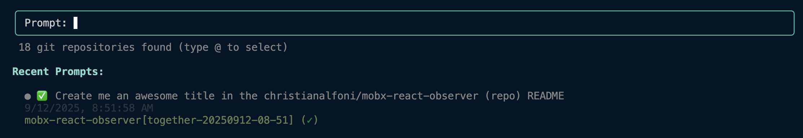

# Together Tasks

IDE agents and CLI agents are great tools to help you on your current focus, but require complex environment setup to execute across repositories or multiple branches in parallel. `together-tasks` gives you a head start on coding tasks. Instead of starting with an empty branch, start with _something_.



In the directory where you clone your repos:

```bash
npx together-tasks
```

- **Interactive Interface**: Terminal UI for submitting prompts and viewing tasks
- **Repository Detection**: Automatically scans for git repositories in the specified directory (Defaults to current)
- **Repository Mentions**: Use `@repo-name` syntax to specify which repository to work on
- **Task Management**: View, track, and delete previous tasks
- **Real-time Updates**: Live progress tracking with task states and step counts
- **Open Tasks Locally**: The agent will always push changes remotely on a branch you can directly open in your local environment (Tap "o")

## CLI Options

- `[path]`: Directory to search for git repositories (default: current directory)
- `--clear`: Clear all sessions, tokens, and cached data
- `--help`: Show help information
